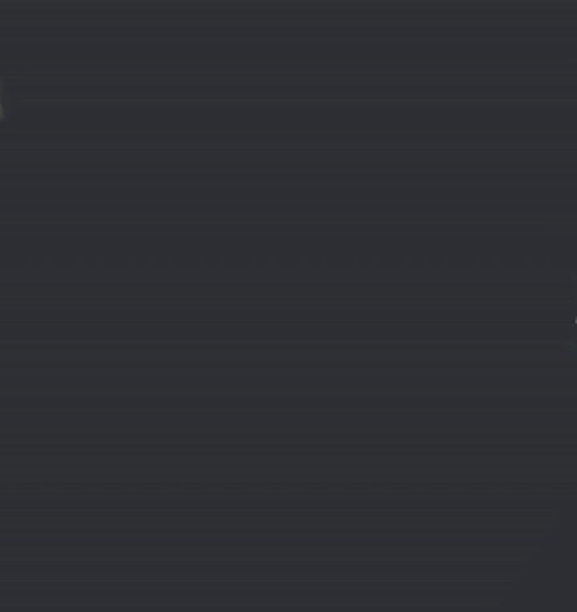

  

  
# Skeleton.gif

Windows overlay to occasionally play a skeleton running gif (with an optional riff sound) on your screen :]

> the source code is kept intentionally simple and portable; feel free to leave comments or PRs for other platforms!

## How to build

> if you just want the default skeleton overlay there's already one in the `Releases` section to download!

1. put all animation frames into the `assets` folder with the format `frame_#` (you can use the `tools/extract_frames.py` script if you have a gif/video you'd like to use.
2. use `tools/build_png_atlas.py` to construct an atlas from the inputted frames
3. use `tools/embed_assets.py` to create your `src/assets_embedded.h` file
4. update the `rows`,`cols` and `frame_count` variables in main.c according to the outputted `assets/meta.json` file
5. run `build.bat`

## Requirements

- Windows
- C17 compiler
- `stb_image.h`

> no, i will not be remaking this with DirectX.
